

# AEC demo page for TASLP submission

## 1. Synthetic RIR Environment

### Synthetic RIR genereted by image source method

| Signal (Model) | Double-talk (DT) Scenario | Far-end Single-talk (FEST) Scenario |
| :--- | :--- | :--- |
| **Far-end** |  <audio controls style="width: 500px;"><source src="Synthetic_RIR/DT/audio/snr24_ser-4_d9990_far-end.wav"></audio> | 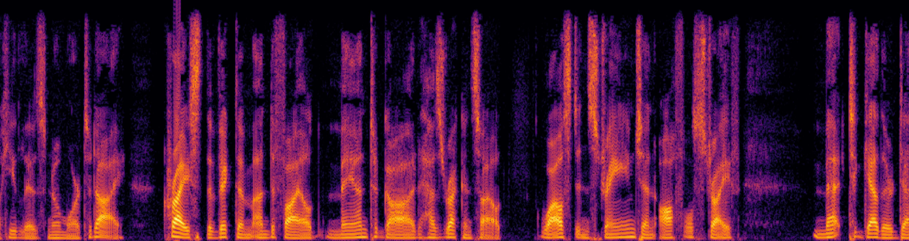 <audio controls style="width: 500px;"><source src="Synthetic_RIR/FEST/audio/snr37_ser-7_d2532_far-end.wav"></audio> |
| **Mic Input (Unprocessed)** |  <audio controls style="width: 500px;"><source src="Synthetic_RIR/DT/audio/snr24_ser-4_d9990_mic.wav"></audio> |  <audio controls style="width: 500px;"><source src="Synthetic_RIR/FEST/audio/snr37_ser-7_d2532_mic.wav"></audio> |
| **Near-end(Label)** |  <audio controls style="width: 500px;"><source src="Synthetic_RIR/DT/audio/snr24_ser-4_d9990_clean.wav"></audio> |  |
| **F-T-LSTM [1]** |  <audio controls style="width: 500px;"><source src="Synthetic_RIR/DT/audio/snr24_ser-4_d9990_F-T-LSTM.wav"></audio> |  <audio controls style="width: 500px;"><source src="Synthetic_RIR/FEST/audio/snr37_ser-7_d2532_F-T-LSTM.wav"></audio> |
| **DeepVQE-S [2]** | 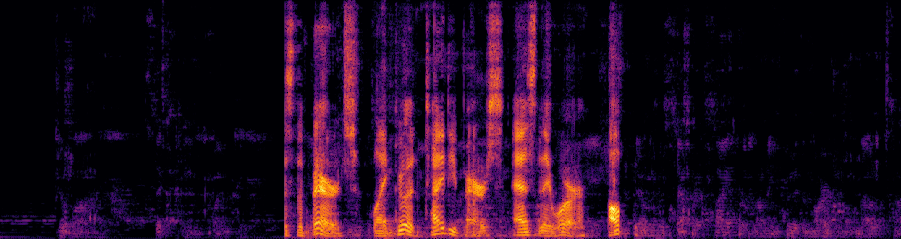 <audio controls style="width: 500px;"><source src="Synthetic_RIR/DT/audio/snr24_ser-4_d9990_DeepVQE-S.wav"></audio> |  <audio controls style="width: 500px;"><source src="Synthetic_RIR/FEST/audio/snr37_ser-7_d2532_DeepVQE-S.wav"></audio> |
| **DeepVQE-L [2]** | 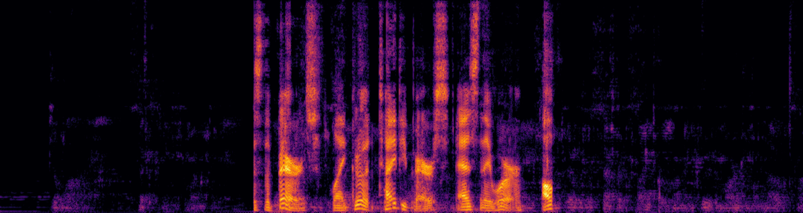 <audio controls style="width: 500px;"><source src="Synthetic_RIR/DT/audio/snr24_ser-4_d9990_DeepVQE-L.wav"></audio> |  <audio controls style="width: 500px;"><source src="Synthetic_RIR/FEST/audio/snr37_ser-7_d2532_DeepVQE-L.wav"></audio> |
| **TSDPANet [3]** |  <audio controls style="width: 500px;"><source src="Synthetic_RIR/DT/audio/snr24_ser-4_d9990_TSDPANet.wav"></audio> |  <audio controls style="width: 500px;"><source src="Synthetic_RIR/FEST/audio/snr37_ser-7_d2532_TSDPANet.wav"></audio> |
| **DeepVQE-SepRe (AEC-only)** |  <audio controls style="width: 500px;"><source src="Synthetic_RIR/DT/audio/snr24_ser-4_d9990_DeepVQE-SepRe_aec.wav"></audio> |  <audio controls style="width: 500px;"><source src="Synthetic_RIR/FEST/audio/snr37_ser-7_d2532_DeepVQE-SepRe_aec.wav"></audio> |
| **DeepVQE-SepRe (Joint-training)**| 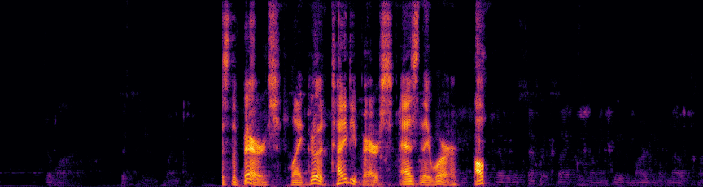 <audio controls style="width: 500px;"><source src="Synthetic_RIR/DT/audio/snr24_ser-4_d9990_DeepVQE-SepRe_joint.wav"></audio> | 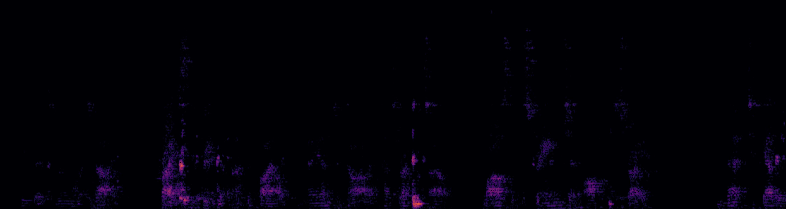 <audio controls style="width: 500px;"><source src="Synthetic_RIR/FEST/audio/snr37_ser-7_d2532_DeepVQE-SepRe_joint.wav"></audio> |

## 2. Real-world RIR Environment

### Unseen real-world RIR from SMARD [4]

| Signal (Model) | Double-talk (DT) Scenario | Far-end Single-talk (FEST) Scenario |
| :--- | :--- | :--- |
| **Far-end** | 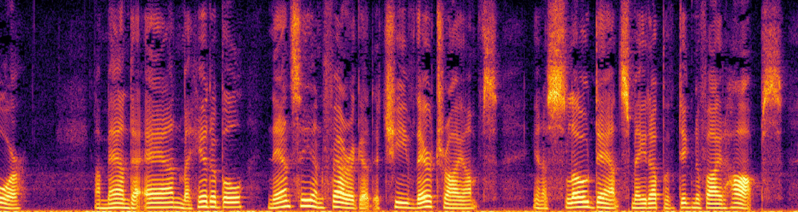 <audio controls style="width: 500px;"><source src="Real_RIR/DT/audio/snr30_ser-1_d5493_far-end.wav"></audio> |  <audio controls style="width: 500px;"><source src="Real_RIR/FEST/audio/snr28_ser-9_d2509_far-end.wav"></audio> |
| **Mic Input** |  <audio controls style="width: 500px;"><source src="Real_RIR/DT/audio/snr30_ser-1_d5493_mic.wav"></audio> | 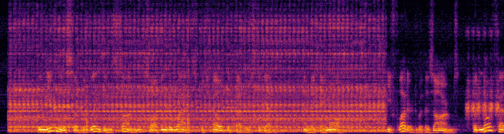 <audio controls style="width: 500px;"><source src="Real_RIR/FEST/audio/snr28_ser-9_d2509_mic.wav"></audio> |
| **Near-end (Label)** | 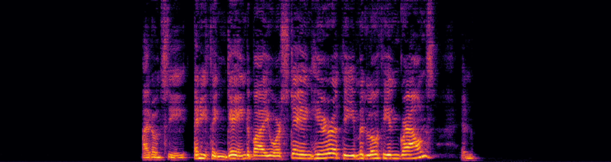 <audio controls style="width: 500px;"><source src="Real_RIR/DT/audio/snr30_ser-1_d5493_clean.wav"></audio> | |
| **F-T-LSTM [1]** |  <audio controls style="width: 500px;"><source src="Real_RIR/DT/audio/snr30_ser-1_d5493_F-T-LSTM.wav"></audio> |  <audio controls style="width: 500px;"><source src="Real_RIR/FEST/audio/snr28_ser-9_d2509_F-T-LSTM.wav"></audio> |
| **DeepVQE-S [2]** |  <audio controls style="width: 500px;"><source src="Real_RIR/DT/audio/snr30_ser-1_d5493_DeepVQE-S.wav"></audio> |  <audio controls style="width: 500px;"><source src="Real_RIR/FEST/audio/snr28_ser-9_d2509_DeepVQE-S.wav"></audio> |
| **DeepVQE-L [2]** |  <audio controls style="width: 500px;"><source src="Real_RIR/DT/audio/snr30_ser-1_d5493_DeepVQE-L.wav"></audio> |  <audio controls style="width: 500px;"><source src="Real_RIR/FEST/audio/snr28_ser-9_d2509_DeepVQE-L.wav"></audio> |
| **TSDPANet [3]** | 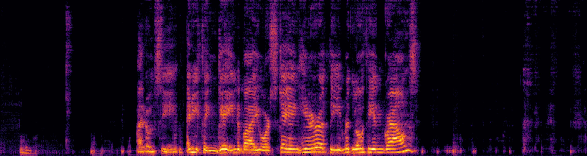 <audio controls style="width: 500px;"><source src="Real_RIR/DT/audio/snr30_ser-1_d5493_TSDPANet.wav"></audio> |  <audio controls style="width: 500px;"><source src="Real_RIR/FEST/audio/snr28_ser-9_d2509_TSDPANet.wav"></audio> |
| **DeepVQE-SepRe (AEC-only)** |  <audio controls style="width: 500px;"><source src="Real_RIR/DT/audio/snr30_ser-1_d5493_DeepVQE_SepRe_aec.wav"></audio> | 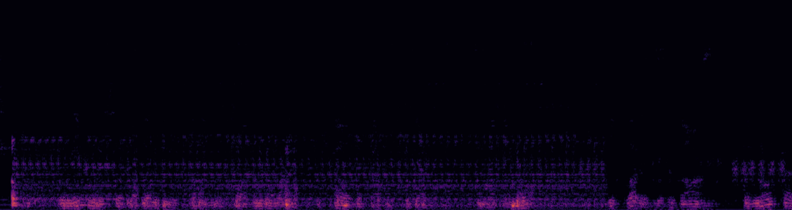 <audio controls style="width: 500px;"><source src="Real_RIR/FEST/audio/snr28_ser-9_d2509_DeepVQE-SepRe_aec.wav"></audio> |
| **DeepVQE-SepRe (Joint-training)**| 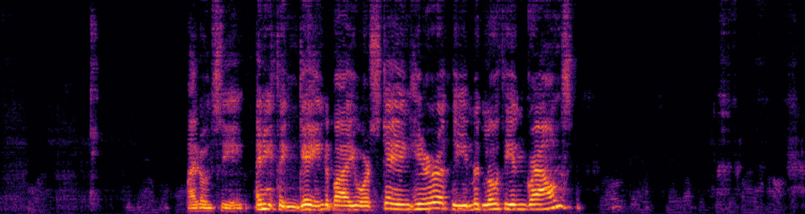 <audio controls style="width: 500px;"><source src="Real_RIR/DT/audio/snr30_ser-1_d5493_DeepVQE_SepRe_joint.wav"></audio> |  <audio controls style="width: 500px;"><source src="Real_RIR/FEST/audio/snr28_ser-9_d2509_DeepVQE-SepRe_joint.wav"></audio> |

## 3. AEC Challenge blind test set

### INTERSPEECH 2021 AEC Challenge blind test set [5]

| Signal (Model) | Double-talk (DT) Scenario | Far-end Single-talk (FEST) Scenario |
| :--- | :--- | :--- |
| **Far-end** | 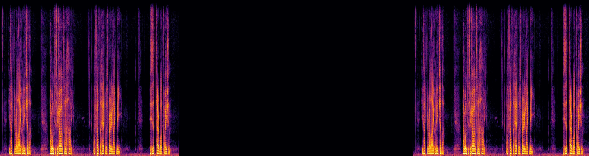 <audio controls style="width: 500px;"><source src="AEC_Challenge/DT/audio/sLi810BoekuU3HSx14LT7A_doubletalk_lpb.wav"></audio> | 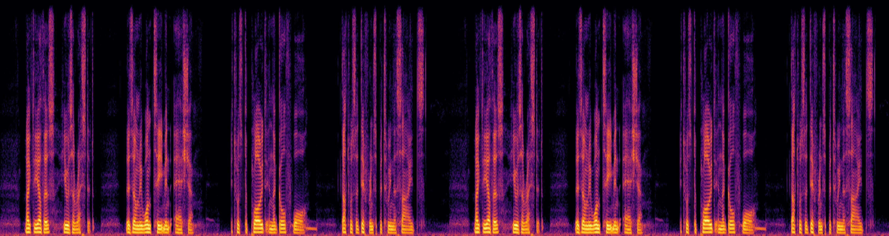 <audio controls style="width: 500px;"><source src="AEC_Challenge/FEST/audio/xYuPW7feGkyc8a1rfcDv9w_farend_singletalk_with_movement_lpb.wav.wav"></audio> |
| **Mic Input** | 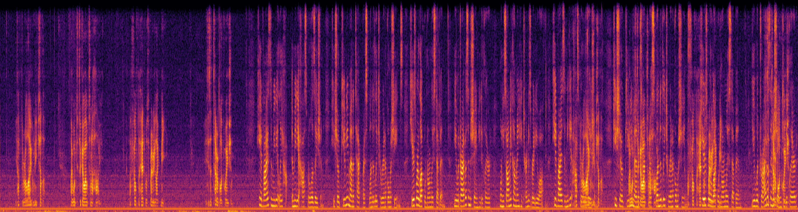 <audio controls style="width: 500px;"><source src="AEC_Challenge/DT/audio/sLi810BoekuU3HSx14LT7A_doubletalk_mic.wav"></audio> | 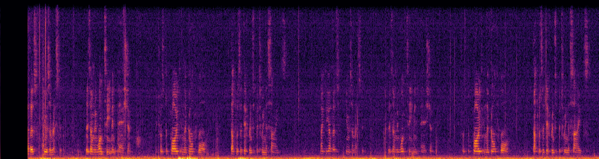 <audio controls style="width: 500px;"><source src="AEC_Challenge/FEST/audio/xYuPW7feGkyc8a1rfcDv9w_farend_singletalk_with_movement_mic.wav_"></audio> |
| **F-T-LSTM [1]** | 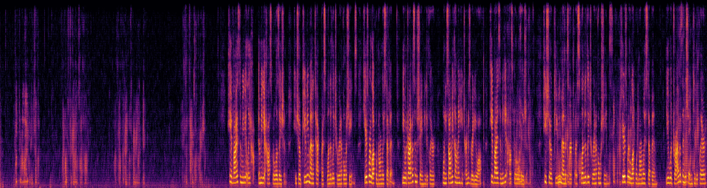 <audio controls style="width: 500px;"><source src="AEC_Challenge/DT/audio/sLi810BoekuU3HSx14LT7A_doubletalk_F-T-LSTM.wav"></audio> | 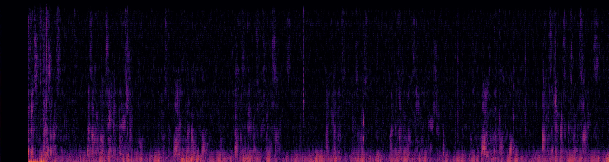 <audio controls style="width: 500px;"><source src="AEC_Challenge/FEST/audio/xYuPW7feGkyc8a1rfcDv9w_farend_singletalk_with_movement_F-T-LSTM.wav"></audio> |
| **DeepVQE-S [2]** | 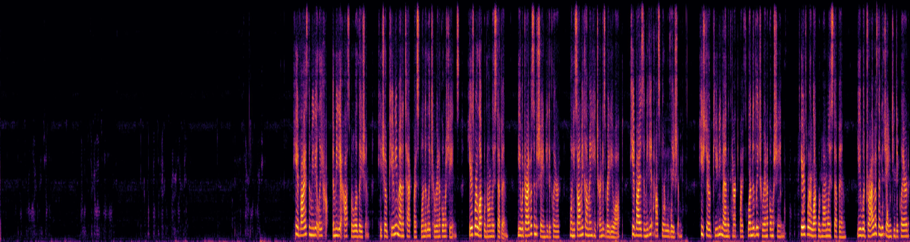 <audio controls style="width: 500px;"><source src="AEC_Challenge/DT/audio/sLi810BoekuU3HSx14LT7A_doubletalk_DeepVQE-S.wav"></audio> | 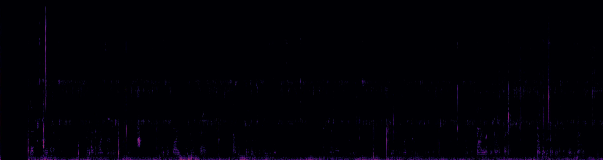 <audio controls style="width: 500px;"><source src="AEC_Challenge/FEST/audio/xYuPW7feGkyc8a1rfcDv9w_farend_singletalk_with_movement_DeepVQE-S.wav"></audio> |
| **DeepVQE-L [2]** | 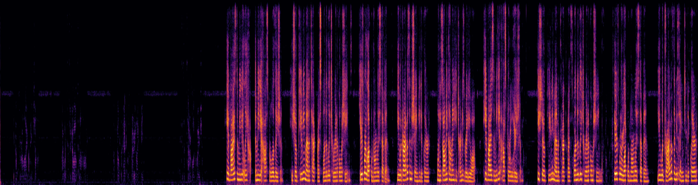 <audio controls style="width: 500px;"><source src="AEC_Challenge/DT/audio/sLi810BoekuU3HSx14LT7A_doubletalk_DeepVQE-L.wav"></audio> | 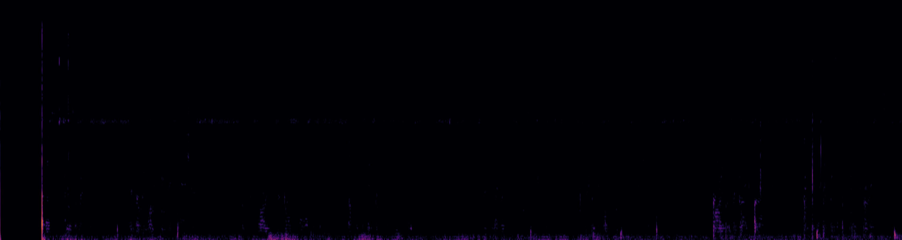 <audio controls style="width: 500px;"><source src="AEC_Challenge/FEST/audio/xYuPW7feGkyc8a1rfcDv9w_farend_singletalk_with_movement_DeepVQE-L.wav"></audio> |
| **TSDPANet [3]** | 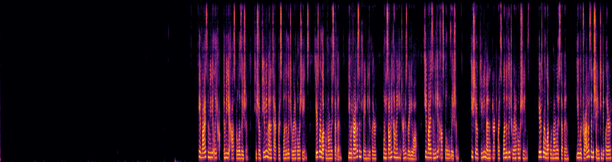 <audio controls style="width: 500px;"><source src="AEC_Challenge/DT/audio/sLi810BoekuU3HSx14LT7A_doubletalk_TSDPANet.wav"></audio> |  <audio controls style="width: 500px;"><source src="AEC_Challenge/FEST/audio/xYuPW7feGkyc8a1rfcDv9w_farend_singletalk_with_movement_TSDPANet.wav"></audio> |
| **DeepVQE-SepRe (AEC-only)** | 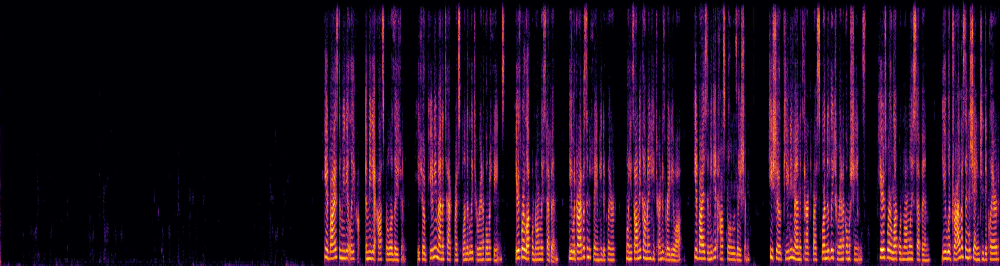 <audio controls style="width: 500px;"><source src="AEC_Challenge/DT/audio/sLi810BoekuU3HSx14LT7A_doubletalk_DeepVQE_SepRe_aec.wav"></audio> | 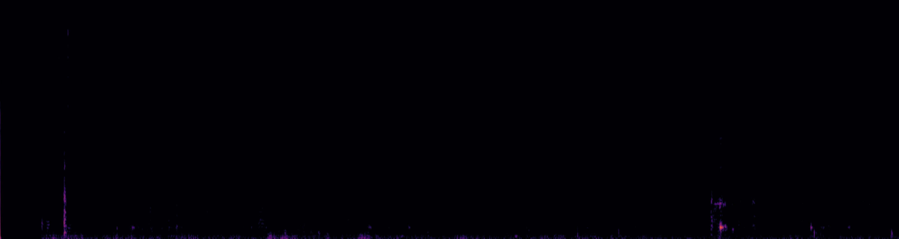 <audio controls style="width: 500px;"><source src="AEC_Challenge/FEST/audio/xYuPW7feGkyc8a1rfcDv9w_farend_singletalk_with_movement_DeepVQE-SepRe_aec.wav"></audio> |
| **DeepVQE-SepRe (Joint-training)**| 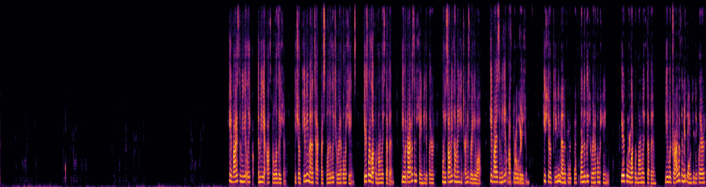 <audio controls style="width: 500px;"><source src="AEC_Challenge/DT/audio/sLi810BoekuU3HSx14LT7A_doubletalk_DeepVQE_SepRe_joint.wav"></audio> | 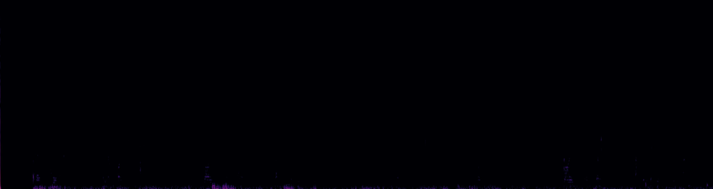 <audio controls style="width: 500px;"><source src="AEC_Challenge/FEST/audio/xYuPW7feGkyc8a1rfcDv9w_farend_singletalk_with_movement_DeepVQE-SepRe_joint.wav"></audio> |

 [1] S. Zhang, Y. Kong, S. Lv, Y. Hu, and L. Xie, “F-T-LSTM based complex network for joint acoustic echo cancellation and speech enhancement,” in Proc. Interspeech, 2021, pp. 4758–4762.

 [2] N. C. Ristea, E. Indenbom, A. Saabas, T. P¨arnamaa, J. Guzhvin, and R. Cutler, “DeepVQE: Real time deep voice quality enhancement for joint acoustic echo cancellation, noise suppression and dereverberation,” in Proc. Interspeech, 2023, pp. 3819–3823.

 [3] Z. Jiang, H. Li, and N. Zheng, “Two-stage acoustic echo cancellation network with dual-path alignment,” in Proc. IEEE Int. Conf. Acoust., Speech Signal Process., 2024, pp. 606–610.

 [4] J. K. Nielsen, J. R. Jensen, S. H. Jensen, and M. G. Christensen, “The
single- and multichannel audio recordings database (SMARD),” in Proc. Int. Workshop Acoust. Signal Enhance., 2014, pp. 40–44.

 [5] R. Cutler et al., “Interspeech 2021 acoustic echo cancellation challenge.” in Proc. Interspeech, 2021, pp. 4748–4752.